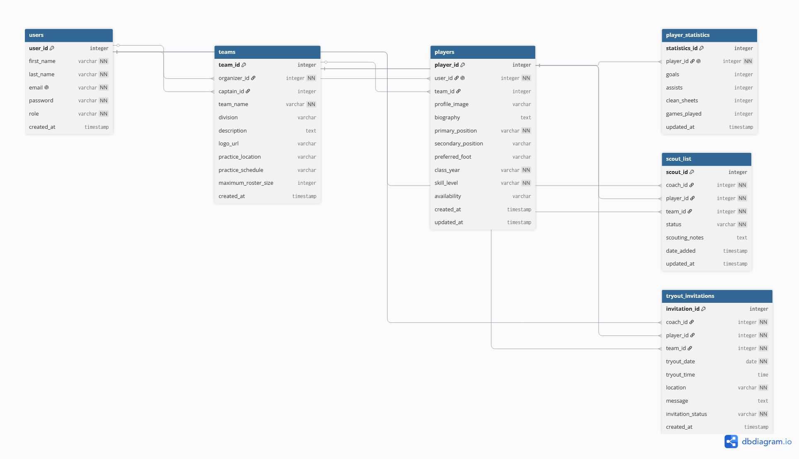

## List of Tables

Our College Football Scout Helper application uses the following six database tables:

1. Users
2. Teams
3. Players
4. Player Statistics
5. Scout List
6. Tryout Invitations

## Entity Relationship Diagram

The diagram below illustrates the database structure for the College Football Scout Helper application.

## Table Attributes

### Table 1 — Users

Stores information about everyone who can use the application, including student players, coaches, captains, and club organizers.

| Column Name | Type | Description |
|-------------|------|-------------|
| user_id | integer | Primary Key |
| first_name | varchar | User's first name |
| last_name | varchar | User's last name |
| email | varchar | User's email address |
| password | varchar | User's encrypted password |
| role | varchar | Player, Coach, Captain, or Organizer |
| created_at | timestamp | Account creation date |

### Table 2 — Teams

Stores football team information.

| Column Name | Type | Description |
|-------------|------|-------------|
| team_id | integer | Primary Key |
| organizer_id | integer | Foreign Key → Users |
| captain_id | integer | Foreign Key → Users |
| team_name | varchar | Team name |
| division | varchar | Competition division |
| description | text | Team description |
| logo_url | varchar | Team logo |
| practice_location | varchar | Practice location |
| practice_schedule | varchar | Practice schedule |
| maximum_roster_size | integer | Maximum players allowed |
| created_at | timestamp | Team creation date |

### Table 3 — Players

Stores each player's football profile.

| Column Name | Type | Description |
|-------------|------|-------------|
| player_id | integer | Primary Key |
| user_id | integer | Foreign Key → Users |
| team_id | integer | Foreign Key → Teams |
| profile_image | varchar | Player photo |
| biography | text | Player biography |
| primary_position | varchar | Main playing position |
| secondary_position | varchar | Secondary position |
| preferred_foot | varchar | Left or Right |
| class_year | varchar | Freshman, Sophomore, Junior, Senior |
| skill_level | varchar | Beginner, Intermediate, Advanced |
| availability | varchar | Availability schedule |
| created_at | timestamp | Profile creation date |
| updated_at | timestamp | Last update |

### Table 4 — Player Statistics 

Stores football performance statistics.

| Column Name | Type | Description |
|-------------|------|-------------|
| statistics_id | integer | Primary Key |
| player_id | integer | Foreign Key → Players |
| goals | integer | Number of goals |
| assists | integer | Number of assists |
| clean_sheets | integer | Number of clean sheets |
| games_played | integer | Total matches played |
| updated_at | timestamp | Last updated |

### Table 5 — Scout List

Stores scouting information for coaches.

| Column Name | Type | Description |
|-------------|------|-------------|
| scout_id | integer | Primary Key |
| coach_id | integer | Foreign Key → Users |
| player_id | integer | Foreign Key → Players |
| team_id | integer | Foreign Key → Teams |
| status | varchar | Scouting status |
| scouting_notes | text | Coach notes |
| date_added | timestamp | Date added |
| updated_at | timestamp | Last updated |

### Table 6 - Tryout Invitations

Stores invitations sent from coaches to players.

| Column Name | Type | Description |
|-------------|------|-------------|
| invitation_id | integer | Primary Key |
| coach_id | integer | Foreign Key → Users |
| player_id | integer | Foreign Key → Players |
| team_id | integer | Foreign Key → Teams |
| tryout_date | date | Date of tryout |
| tryout_time | time | Time of tryout |
| location | varchar | Tryout location |
| message | text | Invitation message |
| invitation_status | varchar | Pending, Accepted, Declined |
| created_at | timestamp | Invitation creation date |

## Relationships

The College Football Scout Helper database uses the following relationships:

### One-to-One (1:1)

- One Player has one Player Statistics record.

### One-to-Many (1:N)

- One Team has many Players.
- One Coach can create many Scout List records.
- One Coach can send many Tryout Invitations.
- One Team can send many Tryout Invitations.

### Many-to-Many (M:N)

- Coaches can scout many Players.
- Players can appear in many Coaches' Scout Lists.

This many-to-many relationship is implemented through the Scout List table.

## Database Design Notes

The database was normalized to reduce duplicate data.

Instead of storing player names, coach names, and team information in multiple tables, the design uses Primary Keys and Foreign Keys to connect related records.

This approach improves consistency, reduces redundancy, and makes querying the database more efficient.
